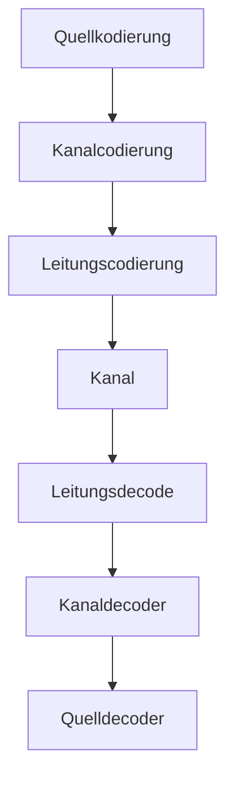

| *Schicht* | *Name*                | *Funktion*        |
| --------- | --------------------- | ----------------- |
| 1         | Bitübertragungschicht | Leitungscodierung |
| 2         | Sicherungsschicht     | Kanalcodierung    |
| 3         | Vermittlungschicht    |                   |
| 4         | Transportschicht      |                   |
| 5         | Sitzungsschicht       |                   |
| 6         | Darstellungsschicht   | Quellkodierung    |
| 7         | Anwendungschicht      |                   |

