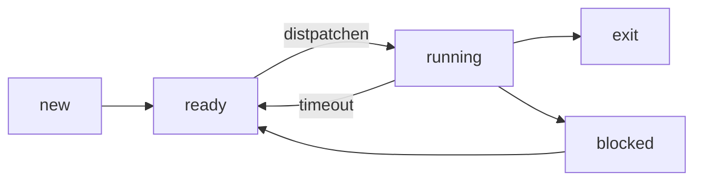
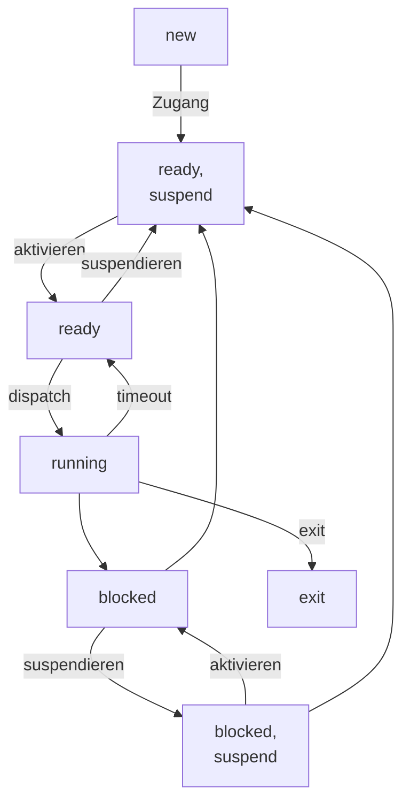

## Usermode und Kernelmode
- Systemmodus (kernel mode) Prozess ist dem Betriebssystem zugeordnet; Nutzermodus (user mode) prozess ist dem Anwedungsprogramm zugeordnet

**Funktionen des Kernels**
- Support Funktion: Interrupts, Accounting, Monitoring
- i/o-Management: Buffer Management, Zuordnung von i/o channel
- Speichermanagement: Zuordnung von Adressräumen zu Prozessen, Swapping, Paging und Segmentmanagement
- Prozessmanagement: Generierung und Terminierung, Scheduling und Dispatching, Prozesssynchronisation und Prozesskommunikation

### Systemaufruf
- Aufruf für Angebote von Diensten durch das Betriebssystem
- Syscall ist synchrone Programmunterbrechung
- Kernelmode: erweiterte Befehlssatz und Zugriff auf bestimme Speicherregionen

### 5 Zustand Prozess Modell

###  7 Zustand Prozess Modell

### Race Condition
- mehrere Prozesse greifen auf die Gleichen Ressourcen zu, das Ergebnis hängt vom Fortschritt und Geschwindigkeit der Prozesse ab