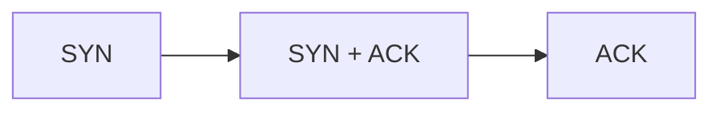
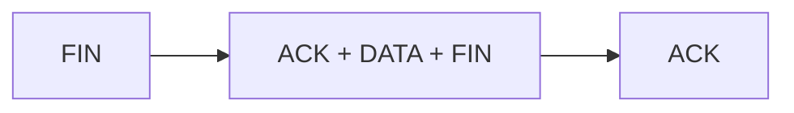

## Multiplexen

- Verbindungsloses Demultiplexen: ```[Ziel-IP, Ziel-Portnummer]```
- Verbindungsorientiertes Demultiplexen: ```[Quell-IP, Quell-Portnummer, Ziel-IP, Ziel- Portnummer]```
-  Ein Server kann viele TCP-Sockets gleichzeitig unterstützen

## UDP

- Verbindungslos
- jedes UDP Segment wird einzeln betrachtet
- 


## TCP
- ermöglicht eine zuverlässige Punkt zu Punkt Übertragung der Datensegmente in Voll-Duplex
- Überlaststeuerung und Flusskontrolle
- 3 Wege Handshake


- Jedes Segment wird mit ACK Quittiert
- Kein ACK innerhalb der Timeout Periode -> Retransmission
Verbindungsabbau:

- Wenn ACK verloren geht wird SEQ nach dem Timeout neu gesendet
- Wenn sich ein ACK verspätet hat ist ein kummulatives ACK möglich]
- Fast Retransmit tritt ein wenn mehrer ACKS für das selbe Segment gesendet werden, dann wird nicht auf das Timeout gewartet