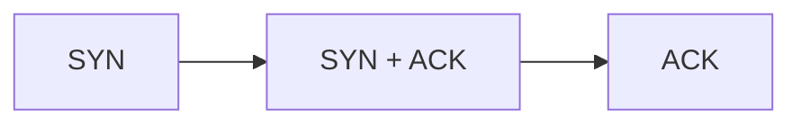
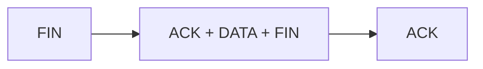

## Multiplexen

- Verbindungsloses Demultiplexen: ```[Ziel-IP, Ziel-Portnummer]```
- Verbindungsorientiertes Demultiplexen: ```[Quell-IP, Quell-Portnummer, Ziel-IP, Ziel- Portnummer]```
-  Ein Server kann viele TCP-Sockets gleichzeitig unterstützen

## UDP

- Verbindungslos
- jedes UDP Segment wird einzeln betrachtet
- 
#### QUIC

## TCP
- ermöglicht eine zuverlässige Punkt zu Punkt Übertragung der Datensegmente in Voll-Duplex
- Überlaststeuerung und Flusskontrolle
- 3 Wege Handshake


- Jedes Segment wird mit ACK Quittiert
- Kein ACK innerhalb der Timeout Periode -> Retransmission
Verbindungsabbau:

- Wenn ACK verloren geht wird SEQ nach dem Timeout neu gesendet
- Wenn sich ein ACK verspätet hat ist ein kummulatives ACK möglich]
- Fast Retransmit tritt ein wenn mehrer ACKS für das selbe Segment gesendet werden, dann wird nicht auf das Timeout gewartet
- TCP nutzt sliding Window beim Empfänger Puffer  um überlauf zu verhindern
- Empfänger teilt Fenstergrösse dem Sender mit und Sender begrenzt die Menge der Daten
- Additive Increase Multiplicative Decrease (AIMD), die Datenrate wird erhöht (additiv) bei Datenverlust wird die Rate verringert (multiplikativ)
- Congestion Window (cwdn) maximale Bytemenge die gesendet werden kann ohne, dass Kollision auftritt meist: 
$$cwdn = \frac{ws}{RTT}$$
- $ws$ Window Size, $RTT$ Round Trip Time
- Slow Start: Nach Verbindungsaufbau wird die Senderate erhöht bis Verlust auftritt: cwdn wird bei jeder RTT verdoppelt -> erst langsam, dann exponentiell
- Fast Recovery: Paketverlust wird erkannt -> 3 doppelte ACKs, $cwdn = \frac{cwdn}{2}$
#### TCP Tahoe
- Slow Start
- AIMD 
- Fast Retransmit
#### TCP Reno
- Slow Start
- AIMD 
- Fast Retransmit
- Fast Recovery
